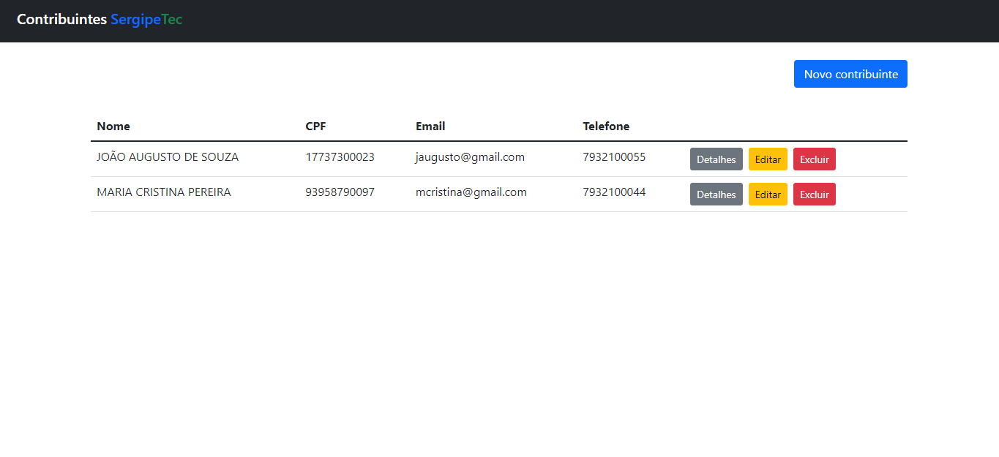
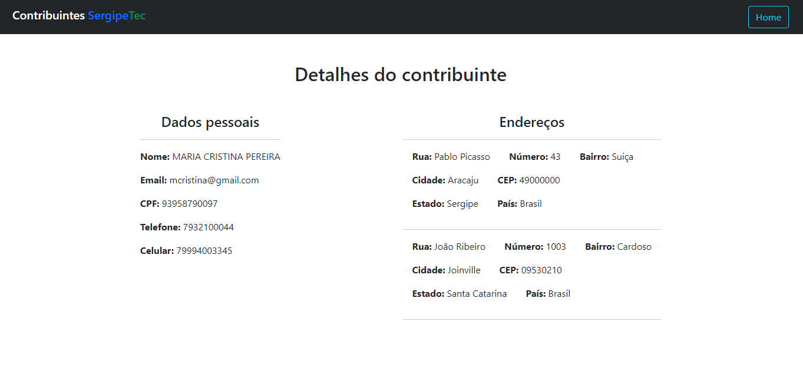
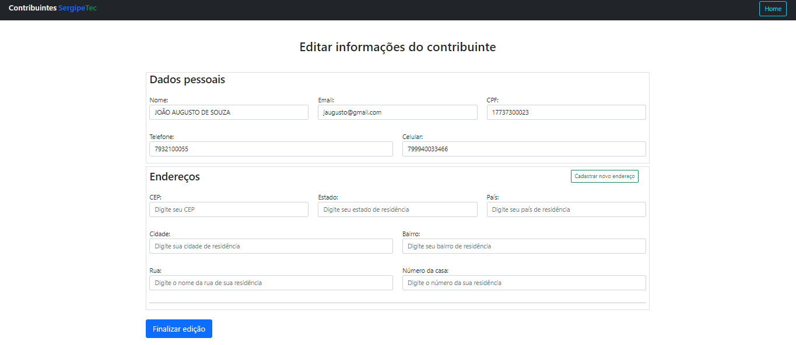

# CRUD DE CONTRIBUINTES - SERGIPETEC

Projeto desenvolvido em processo seletivo para vaga Front-end, no SergipeTec.

## Funcionalidades:

<table>
  <tr>
    <td>Listagem de contribuintes</td>
    <td>Cadastro de novos contribuintes</td>
    <td>Edição de dados de contribuintes</td>
    <td>Checagem de detalhes de contribuintes</td>
  </tr>
   <tr>
    <td>Deletar dados de contribuintes</td>
    <td>Adição de múltiplos endereços para cada contribuinte</td>
    <td>Validação de formulário</td>
  </tr>
</table>

## Prints de tela:

  
  

  
  

## Tecnologias usadas:
<table>
  <tr>
    <td>ANGULAR 2+</td>
    <td>BOOTSTRAP</td>
    <td>JSON SERVER</td>
  </tr>
</table>
